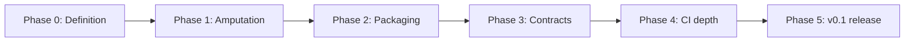

# ProjectScanner — Productization Roadmap

## North star

A **~100-file** product repo that confidently scans **15,000-file** portfolios and hands structured evidence to DreamVault — without looking like the mess it measures.

## Current state (baseline)

| Signal | Status |
|---|---|
| Core scanner (`src/core/projectscanner/`) | Working, canonical |
| Tests (`pytest -q`) | 19 passed, 1 skipped |
| CI snapshot workflow | Present |
| SQLite ingest | Present |
| Portfolio export script | Present |
| Packaging (`pyproject.toml`) | Minimal — no console script |
| Entry points | Fragmented — `main.py`, `run.py`, package CLI, GUI launchers |
| Strategic docs (PRD, ROADMAP, NEXT_UP) | Were stubs — now productized |
| GUI | Broken imports (`enhanced_gui`, analysis modules missing) |
| Root clutter | One-off fix scripts, duplicate launchers |

## Phases

### Phase 0 — Product definition (this PR)

**Goal:** Agree what the product is and what gets cut.

- [x] Real PRD with scope, boundaries, file budget
- [x] Roadmap with phased delivery
- [x] Production readiness checklist with honest gaps
- [x] NEXT_UP aligned to first implementation slice
- [ ] Stakeholder sign-off on GUI deferral and archive policy

**Exit criteria:** No stub placeholders in PRD/ROADMAP/PRODUCTION_READINESS/NEXT_UP.

---

### Phase 1 — Surgical amputation

**Goal:** One obvious way to run the scanner; remove dead paths.

| Task | Detail |
|---|---|
| Unify CLI | `projectscanner scan|export|ingest` delegating to existing modules |
| Deprecate shims | `main.py` becomes thin wrapper or removed after one cycle |
| Retire `run.py` overlap | Merge unique discovery logic into `scan` subcommand or `export` |
| Fix or quarantine GUI | Either wire to `demo_gui.py` or mark `[gui]` extra with working imports |
| Root script audit | Move `ingest_snapshot.py`, `scan_targets.py` under `src/` or `scripts/` |
| Delete one-off fix scripts | `final_comment_fix.py`, `mark_long_functions.py`, `show_long_functions.py` → git history only |

**Exit criteria:** Documented quick start uses one command; zero imports of missing modules.

---

### Phase 2 — Packaging and install story

**Goal:** `pip install -e .` is the default onboarding path.

| Task | Detail |
|---|---|
| Console script | `[project.scripts] projectscanner = "projectscanner.cli:main"` |
| Package layout | Expose `src/core/projectscanner` as installable package |
| Dependencies | Split core vs optional `[gui]` (PyQt5) vs `[dev]` (pytest, ruff) |
| Versioning | Semver starting at `0.1.0` |
| LICENSE + README | Install, scan, export, verify in README |

**Exit criteria:** Fresh venv → install → scan → pass tests without `sys.path` hacks.

---

### Phase 3 — Output contracts and DreamVault handoff

**Goal:** Downstream tools trust scanner output without defensive parsing.

| Task | Detail |
|---|---|
| `schema_version` in `analysis.json` | Bump on breaking changes |
| Export bundle validation | Tests for required keys in intelligence export |
| Ingest hardening | `ingest_snapshot.py` rejects malformed payloads with clear errors |
| Query ergonomics | `projectscanner history --last 10` or equivalent |
| DreamVault path docs | Single documented output directory convention |

**Exit criteria:** DreamVault can ingest exports without schema guesswork.

---

### Phase 4 — CI confidence depth

**Goal:** Product changes cannot silently break scan or ingest contracts.

| Task | Detail |
|---|---|
| Snapshot workflow tests | Mode derivation, metadata integrity |
| Ingest fixture tests | Malformed `analysis.json` cases |
| PR comment safety | Missing fields do not crash workflow |
| Performance smoke | Scan `./src` under time budget in CI |

**Exit criteria:** Contract regressions caught in PR, not in DreamVault.

---

### Phase 5 — v0.1 release

**Goal:** Tag a credible beta for portfolio operators.

| Deliverable | Notes |
|---|---|
| GitHub release `v0.1.0` | Changelog, install instructions |
| Optional GUI extra | Only if Phase 1 quarantine resolved |
| Archive policy executed | Overlay experiment removed from default tree |
| Portfolio README sync | Regenerate DreamVault portfolio block |

**Exit criteria:** Operator can adopt without reading `archive/` or root fix scripts.

---

## What we are not doing

- Rewriting the scanner engine from scratch
- Absorbing DreamVault governance into this repo
- Committing 15k-file scan dumps into git
- Adding features before entry points and contracts are stable

## Dependency graph

## Immediate next slice (Phase 1 start)

See `NEXT_UP.md` — first implementation PR should be CLI unification only, no scanner rewrite.
